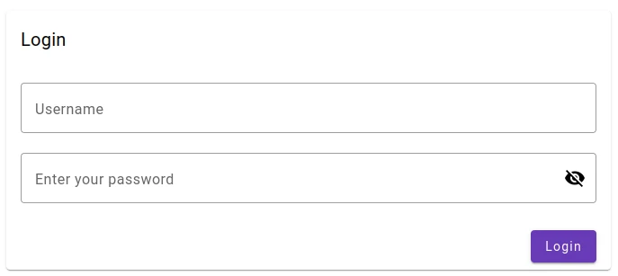
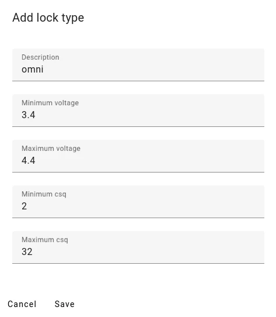
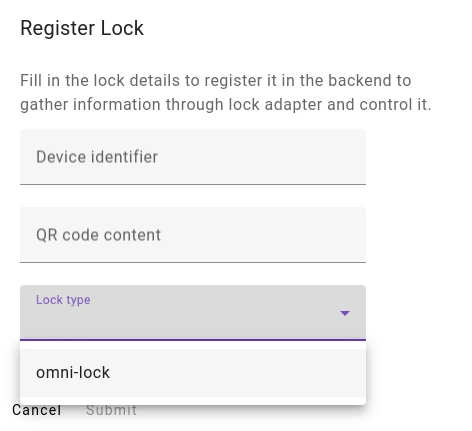

# ShareABikeAdmin

## Functionalities

### Login
The login account needs ROLE_ADMIN

### Create lock type
If the lock type is for omni-locks, the name has to contain _omni_
Fill in the data corresponding to the datasheet.

For Omni locks the inputs should be like following:

### Create lock

