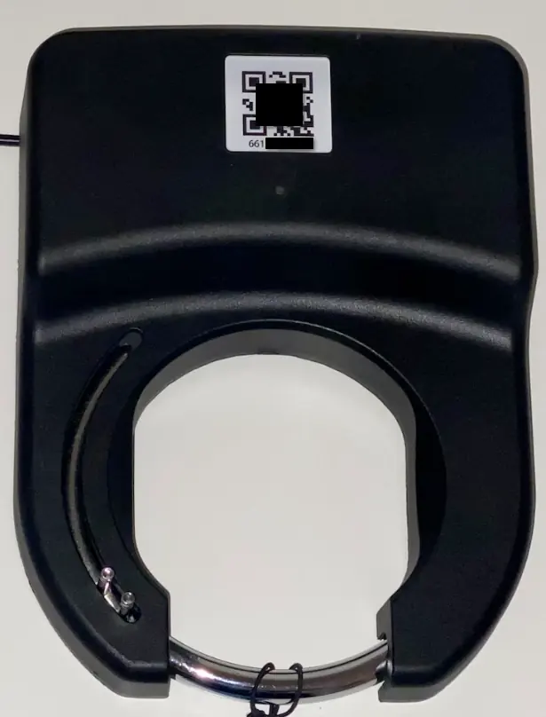
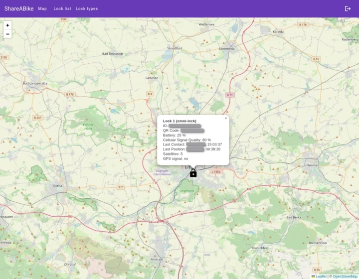

# ShareABikeAdmin

## Functionalities

### Login

The login account needs ROLE_ADMIN

### Create lock type

If the lock type is for omni-locks, the name has to contain _omni_
Fill in the data corresponding to the datasheet.

For Omni locks the inputs should be like following:

### Create lock

The IMEI is shown in the *BleTool* app and in the adapter logs when the adapter url is set in the lock settings.
The QR code content is the text in the qr code

## Showcase

